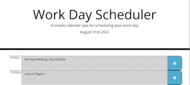

# My Work Schedule 
<h2> Motivation </h2>

 Tracking time and keeping commitments are important in the world of business. 
Maintaining organization on a daily basis with timing events; will contribute to future time management sucess. 

<h2> Problem </h2>

 Time management tool required for employee day planning. 

<h2> Solution </h2>

 Create a scheduler with start of work day until end of workday. 
Retain key details for the user by saving them in the description field so no tasks/reminders are lost. 

<h2>User Story <h2> 

 
 As an employee with a busy schedule, I want a time management calendar that helps me log events and details. In order to manage my time effectively, I would like for these to have a clear dichotomy between past, present, and future time frames.

<h2> Issues Encountered & Learning Opportunities </h2>

<ol>
<li> Separating JQUERY and JavaScript</li>
<li> Identifying different syntax structure for JQUERY</li>
<li> Refraining from getting too granular.
 Ex: I spent time looking up how to consider the minutes of a clock when building and we only were to focus on the hours. </li>

</img>